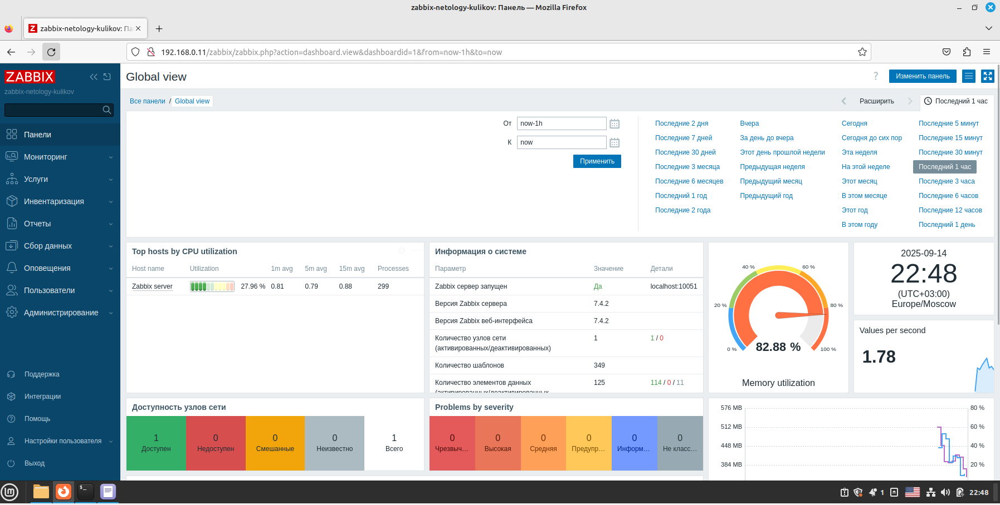
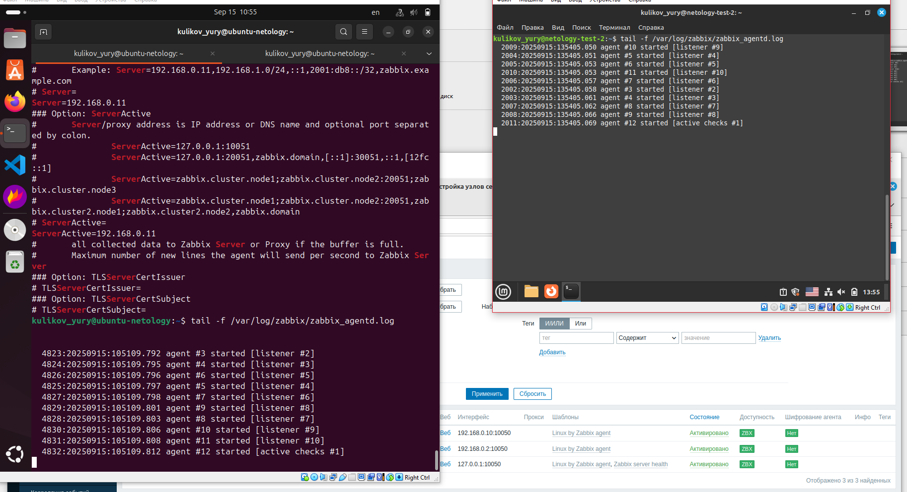

# Домашнее задание к занятию "``"Система мониторинга Zabbix. Часть 1 - `Куликов Юрий`


### Задание 1

Установка zabbix-server, zabbix-agent, postgresql:

```
sudo apt update
sudo apt install postgresql
wget https://repo.zabbix.com/zabbix/7.4/release/debian/pool/main/z/zabbix-release/zabbix-release_latest_7.4+debian12_all.deb
sudo dpkg -i zabbix-release_latest_7.4+debian12_all.deb
sudo apt update
sudo apt install zabbix-server-pgsql zabbix-frontend-php php8.2-pgsql zabbix-apache-conf zabbix-sql-scripts zabbix-agent
sudo -u postgres createuser --pwprompt zabbix
sudo -u postgres createdb -O zabbix zabbix
zcat /usr/share/zabbix/sql-scripts/postgresql/server.sql.gz | sudo -u zabbix psql zabbix
sudo sed -i 's/# DBPassword=/DBPassword=zabbix/g' /etc/zabbix/zabbix_server.conf
sudo systemctl restart zabbix-server zabbix-agent apache2
sudo systemctl enable zabbix-server zabbix-agent apache2
```
Статус служжбы zabbix-server:

Авторизация в web-интерфейсе админки:


---

### Задание 2
Раздел Configuration > Hosts:


Мониторинг хостов:


Lates data:


Пример графика одной из метрик:


Вывод лога zabbix-агента:


tcpdump обмена zabbix-агента с сервером:


```
Установка zabbix agent на VM с ubuntu (noble):

wget https://repo.zabbix.com/zabbix/7.4/release/ubuntu/pool/main/z/zabbix-release/zabbix-release_latest_7.4+ubuntu24.04_all.deb
dpkg -i zabbix-release_latest_7.4+ubuntu24.04_all.deb
sudo apt update
sudo apt install zabbix-agent
sudo systemctl restart zabbix-agent
sudo systemctl enable zabbix-agent
sudo sed -i 's/Server=127.0.0.1/Server=192.168.0.11/g' /etc/zabbix/zabbix_agentd.conf
sudo systemctl restart zabbix-agent.service 
```

```
Просмотр логов zabbix agent:

tail -f /var/log/zabbix/zabbix_agentd.log
```